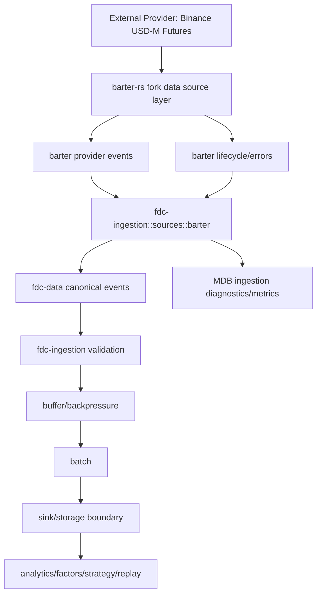

# barter-rs 数据源层与 MDB ingestion bridge 设计

## 1. 决策结论

MDB 不再建设独立的 `fdc-adapters` provider adapter 大模块。后续市场数据、衍生品数据、reference 数据等外部数据源采集能力，优先在 `barter-rs` fork 中扩展和沉淀。

MDB 侧只在 `fdc-ingestion` 中建设一个薄的 barter bridge，用于把 `barter-rs` 输出转换为 MDB canonical data pipeline 可消费的事件。

最终分层：

```text
barter-rs fork
  通用数据源采集层
  provider connector / ws / rest / subscription / reconnect / provider event model
        |
        v
mdb::fdc-ingestion::sources::barter
  MDB ingestion bridge
  barter event -> fdc-data canonical event
  lifecycle/error/quality/lineage enrichment
        |
        v
mdb::fdc-ingestion pipeline
  buffer / batch / backpressure / validation / sink boundary
        |
        v
storage / analytics / strategy / replay
```

这意味着 `fdc-adapters` 文档中的 provider framework 方向被降级为历史分析输入。`fdc-adapters` 可以继续保留 barter-rs 分析文档，但不作为 MDB 内部 provider runtime 的实现目标。

---

## 2. 背景

当前 MDB 已经具备：

- `fdc-data` canonical market data model，包括 trade、quote、bar、order book snapshot/delta、funding rate、open interest、mark price、index price、liquidation；
- `fdc-data` reference model，包括 exchange、venue、instrument、symbol alias、quantity spec、contract spec；
- `fdc-ingestion` 基础接入管线，包括 receiver、parser、validator、buffer、batch、backpressure、recovery、metrics。

barter-rs 已经具备或接近具备：

- WebSocket/REST 底层集成；
- exchange connector、subscription、subscription mapper、subscription validator；
- dynamic streams、stream builder、多流合并；
- reconnect、terminal error、lifecycle event；
- trades、L1/L2 order book、Binance USD-M Futures liquidation 等实时数据采集；
- Binance L2 snapshot + delta sequencing 的关键流程。

因此，MDB 不应在自身仓库内重复实现 provider connector、WebSocket 订阅、重连和交易所 raw schema 解析。更合理的长期主线是让 barter-rs fork 演进为通用数据源采集层，MDB 专注于数据维护和后续分析能力。

---

## 3. 架构边界

### 3.1 barter-rs fork 职责

barter-rs fork 负责所有外部数据来源采集能力，包括：

1. provider/exchange connector；
2. WebSocket 和 REST transport；
3. subscription model、subscription request construction、ack validation；
4. live stream、historical REST、snapshot fetch、replay/file source 的通用抽象；
5. provider raw payload decode；
6. provider-level normalized event；
7. reconnect、rate limit、resync、terminal error 处理；
8. provider capability matrix；
9. Binance USD-M Futures 完整 D 所需数据采集能力。

barter-rs fork 可以继续使用自己的领域模型和 event model，但需要逐步改善数据精度和通用性，尤其避免金融数值经由 `f64` 中转。

### 3.2 MDB `fdc-ingestion` 职责

MDB 的 `fdc-ingestion` 负责数据进入 MDB 后的接入处理：

1. 从 barter-rs stream 消费事件；
2. 将 barter-rs event 映射到 `fdc-data` canonical event；
3. 补充 MDB 所需 `quality`、`lineage`、source metadata；
4. 将 barter-rs lifecycle/error 映射为 MDB ingestion status、metric 和 diagnostic；
5. 接入现有 buffer、batch、backpressure、validation、sink pipeline；
6. 保证 MDB 下游只依赖 `fdc-data` 和 ingestion event，不直接依赖 barter-rs 类型。

### 3.3 `fdc-data` 职责

`fdc-data` 继续作为 MDB 唯一 canonical data model。

规则：

- `fdc-data` 不依赖 barter-rs；
- `fdc-data` 不依赖 `fdc-ingestion`；
- barter-rs 类型不能泄漏到 `fdc-data`；
- 进入 MDB 存储、分析、策略、回放之前，事件必须先转换为 `fdc-data` canonical model。

---

## 4. 数据流



核心约束：

- `fdc-ingestion::sources::barter` 是 barter-rs 类型进入 MDB 的唯一边界；
- 下游 pipeline 只处理 MDB canonical event；
- raw provider payload 可作为 lineage/diagnostic 引用保留，但不污染 canonical record；
- lifecycle event 不应丢弃，需要进入 metrics、health 和可观测事件流。

---

## 5. 完整 D 数据范围

完整 D 仍作为第一阶段业务目标，优先围绕 Binance USD-M Futures 完成。

### 5.1 需要在 barter-rs fork 中优先实现或确认的能力

| 数据能力 | barter-rs 当前状态 | 后续动作 |
| --- | --- | --- |
| Public trades | 已有较成熟实现 | 确认 Binance USD-M Futures 输出字段、精度和 event time。 |
| L2 order book snapshot/delta | 已有 Binance snapshot + delta sequencing 参考 | 强化 sequence gap、resync、absolute quantity、delete level 行为测试。 |
| Liquidations | 已有 Binance USD-M Futures 相关实现 | 确认 side 语义并补充 fixture。 |
| Funding rate | 缺失或不完整 | 在 barter-rs fork 增加 REST historical funding 和 live/mark stream funding 字段支持。 |
| Open interest | 缺失或不完整 | 在 barter-rs fork 增加 REST polling source，明确 quantity/notional 语义。 |
| Mark price | 缺失或不完整 | 在 barter-rs fork 增加 mark price stream/REST source。 |
| Index price | 缺失或不完整 | 在 barter-rs fork 增加 index price stream/REST source。 |
| Reference/instrument discovery | 缺失或不完整 | 在 barter-rs fork 增加 exchangeInfo/instrument discovery source。 |
| Replay/file source | 非 barter-data 通用 contract | 在 barter-rs fork 中抽象 deterministic replay source。 |
| Capability matrix | 不完整 | 增加 provider capability descriptor，声明支持 domains/kinds/modes/transports。 |

### 5.2 MDB bridge 需要映射的 canonical 输出

`fdc-ingestion::sources::barter` 至少要映射：

- `fdc_data::market::Trade`；
- `fdc_data::market::OrderBookSnapshot`；
- `fdc_data::market::OrderBookDelta`；
- `fdc_data::market::Liquidation`；
- `fdc_data::market::FundingRate`；
- `fdc_data::market::OpenInterest`；
- `fdc_data::market::MarkPrice`；
- `fdc_data::market::IndexPrice`；
- `fdc_data::reference::Instrument`；
- lifecycle/diagnostic events for connected、subscribed、snapshot_loaded、sequence_gap、resync_started、reconnected、rate_limited、fatal_error。

---

## 6. MDB bridge 模块建议

建议在 `fdc-ingestion` 内新增 source bridge，而不是新建 `fdc-adapters` crate。

```text
crates/fdc-ingestion/src/
  sources/
    mod.rs
    barter.rs
    event.rs
    config.rs
    mapper/
      mod.rs
      market.rs
      reference.rs
      lifecycle.rs
```

建议公共概念：

```rust
pub enum IngestionSourceEvent {
    Market(fdc_data::market::MarketEvent),
    Reference(ReferenceIngestionEvent),
    Lifecycle(SourceLifecycleEvent),
    Diagnostic(SourceDiagnostic),
}
```

`barter.rs` 负责启动或接收 barter-rs stream。`mapper` 负责纯转换逻辑，转换逻辑应可用 fixtures 单独测试。

重要原则：

- `sources::barter` 可以依赖 barter-rs；
- `buffer`、`batch`、`validator`、`storage` 等下游模块不依赖 barter-rs；
- mapping 不应使用 `f64` 作为中间金融数值；
- 如果 barter-rs event 已经丢失精度，优先回到 barter-rs fork 修复 raw parse。

---

## 7. 双项目任务拆分

### 7.1 barter-rs fork 任务线

1. 建立 MDB 所需数据范围的 tracking matrix；
2. 梳理 Binance USD-M Futures 现有 trade、L2、liquidation 实现和 fixture 覆盖；
3. 增加 funding rate 数据源；
4. 增加 open interest 数据源；
5. 增加 mark price 数据源；
6. 增加 index price 数据源；
7. 增加 reference/instrument discovery source；
8. 增加 capability descriptor；
9. 增加 deterministic replay/file source；
10. 强化 Decimal/string-preserving parse，避免金融数值经 `f64` 中转；
11. 输出稳定的 provider event/lifecycle/error contract，供 MDB bridge 消费。

### 7.2 MDB 任务线

1. 在 `fdc-ingestion` 增加 `sources` 模块；
2. 定义 `IngestionSourceEvent`、lifecycle、diagnostic bridge event；
3. 增加 barter-rs stream source config；
4. 实现 barter market event 到 `fdc_data::market::MarketEvent` 的 mapper；
5. 实现 barter reference event 到 `fdc_data::reference` 的 mapper；
6. 实现 lifecycle/error 到 ingestion metrics/diagnostics 的 mapper；
7. 将 source event 接入现有 validation、buffer、batch、backpressure；
8. 增加 fixture-based mapping tests；
9. 增加 replay determinism tests；
10. 增加端到端 smoke test：barter fixture stream -> fdc-data event -> ingestion buffer/batch。

---

## 8. 里程碑建议

### M1：决策落地与接口冻结

- 本文档确认；
- `fdc-adapters` 不作为实现目标；
- MDB 定义 `fdc-ingestion::sources` 边界；
- barter-rs fork 定义 MDB 完整 D tracking matrix。

### M2：barter-rs Binance USD-M Futures 完整 D 数据源

- trades、L2、liquidation fixture 和行为确认；
- funding/open interest/mark/index/reference discovery 实现；
- capability descriptor 和 lifecycle/error contract 初版。

### M3：MDB ingestion bridge 初版

- `sources::barter` 接入；
- market/reference/lifecycle mapper；
- 接入 validation、buffer、batch；
- fixture mapping tests 通过。

### M4：端到端数据闭环

- Binance USD-M Futures live 或 replay stream；
- 转换为 `fdc-data` canonical events；
- 进入 ingestion pipeline；
- 为 storage、analytics、factor、strategy replay 提供稳定输入。

---

## 9. 风险与控制

| 风险 | 控制方式 |
| --- | --- |
| MDB 下游直接依赖 barter-rs 类型 | 只允许 `fdc-ingestion::sources::barter` 引入 barter-rs。下游 API 使用 `fdc-data`。 |
| barter-rs 当前 `f64` 路径导致精度损失 | 优先在 barter-rs fork 修复 raw parse，MDB bridge 禁止再经 `f64` 转换。 |
| barter-rs 能力矩阵与 MDB 完整 D 不一致 | 使用 tracking matrix 管理差距，缺失能力先在 barter-rs fork 开发。 |
| reference/historical/replay 不适合原 barter-data 架构 | 将 barter-rs fork 从 exchange live market data 演进为 provider data source layer。 |
| fdc-ingestion 现有 parser/validator 偏 raw bytes | source bridge 输出 typed canonical event，必要时为 typed source event 增加专门 validation path。 |

---

## 10. 结论

MDB 的长期职责是维护 canonical data、数据质量、ingestion pipeline、storage 前处理和分析能力基础，不负责重复建设 provider adapter runtime。

下一步应先进入 barter-rs fork，补齐 MDB 完整 D 所需的数据源能力。待 barter-rs fork 具备稳定输出后，再在 MDB 的 `fdc-ingestion::sources::barter` 中实现薄桥接层，把 barter-rs 事件转换为 `fdc-data` canonical events 并接入 ingestion pipeline。
