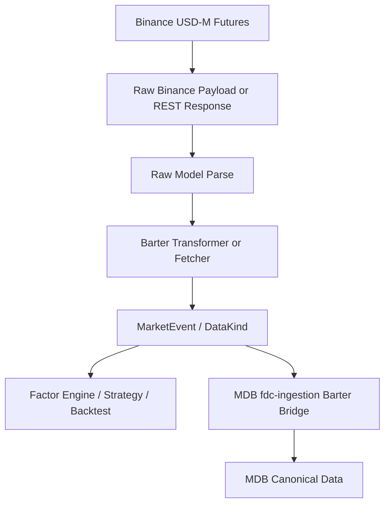

# Market Data Extension Design for Factor, Strategy, and Financial Analysis

## Status

Approved for design by user on 2026-07-15.

## Context

The current repository is a `barter-rs` fork with a multi-crate workspace. The relevant extension point is `barter-data`.

Current `barter-data` already provides:

- `StreamBuilder` and `DynamicStreams` for market data stream construction.
- `Subscription`, `SubscriptionKind`, and `SubKind` for exchange/data-kind subscriptions.
- `MarketEvent` and `DataKind` as the normalized event envelope.
- Binance Spot and Binance USD-M Futures exchange connectors.
- WebSocket subscription request construction and validation.
- Reconnecting streams with terminal error handling.
- Existing normalized data for trades, L1 order book, L2 order book, candles, and liquidations.
- Binance USD-M Futures support for public trades, L1, L2 snapshot/delta sequencing, and liquidations.

The copied bridge document establishes that MDB should not build a separate large `fdc-adapters` provider runtime. Instead, this `barter-rs` fork should evolve into the external data source collection layer, while MDB `fdc-ingestion` should remain a thin bridge from barter output into MDB canonical events.

## Problem

For factor calculation, strategy execution, backtesting, replay, and financial analysis, the current `barter-data` surface is not yet complete.

Confirmed gaps:

- Binance USD-M Futures candles/bars are not fully wired, despite `Candles`, `Candle`, `SubKind::Candles`, and `DataKind::Candle` existing.
- `DynamicStreams::select_all` does not include candles.
- Binance USD-M Futures support matrix does not declare candle support.
- Funding rate is missing.
- Open interest is missing.
- Mark price is missing.
- Index price is missing.
- Binance `exchangeInfo` reference discovery is missing.
- Capability descriptor/matrix is missing.
- Some existing models use `f64` for financial values. New models should avoid expanding this debt.

## Goals

1. Extend `barter-data` into a stronger Binance USD-M Futures data source layer.
2. Provide market data required for factor calculation and strategy running.
3. Keep each implementation task small, independently testable, and reviewable.
4. Use existing `barter-data` abstractions before introducing new abstractions.
5. Preserve a clean boundary for later MDB ingestion bridge mapping.
6. Prefer `Decimal` or string-preserving parsing for new financial numeric fields.

## Non-goals

- Do not create an MDB-side `fdc-adapters` runtime.
- Do not implement MDB `fdc-ingestion` bridge in this phase.
- Do not refactor all existing `f64` models before adding new data types.
- Do not put macro, fundamental, news, or on-chain providers into the first implementation phase.
- Do not build a large generic provider framework before proving each data type with Binance USD-M Futures.

## Data Scope

### Layer 1: Required for strategy execution and core factors

These should be supported first in `barter-data`:

1. Public trades.
2. L1 best bid/ask.
3. L2 order book snapshot/delta.
4. Candles/bars.
5. Funding rate.
6. Mark price.
7. Index price.
8. Open interest.
9. Liquidations.
10. Instrument reference/exchangeInfo.

### Layer 2: Factor enhancement data

These should be added after Layer 1 is stable:

1. Taker buy/sell volume.
2. Aggregated trade.
3. Long/short account ratio.
4. Top trader long/short ratio.
5. Taker long/short ratio.
6. Basis/premium index.
7. Book ticker.
8. 24h ticker stats.
9. Derived volatility inputs from bars.
10. Session/calendar metadata.

### Layer 3: Financial analysis provider extensions

These are useful for financial analysis but should not be part of the first `barter-data` market-data MVP:

1. Risk-free rate.
2. Macro calendar.
3. Equity/ETF/index OHLCV.
4. Fundamental data.
5. Corporate actions.
6. News/sentiment.
7. On-chain metrics.
8. Funding curve/term structure.
9. Cross-exchange basis.
10. Stablecoin liquidity/exchange reserve.

Layer 3 should later be handled by separate provider modules or crates with a source abstraction, not mixed directly into the first Binance USD-M market data path.

## Recommended Implementation Sequence

### Task 1: Binance USD-M Futures Candles/Bars

Rationale:

- Bars are foundational for factor calculation, backtesting, and strategy signals.
- The normalized `Candles` and `Candle` types already exist.
- This is the smallest high-value increment.

Expected changes:

- Add Binance kline/channel support for USD-M Futures.
- Add raw Binance kline payload model and transformer.
- Wire `StreamSelector<Instrument, Candles>` for `BinanceFuturesUsd`.
- Extend support matrix for `SubKind::Candles` on Binance USD-M perpetual instruments.
- Add candle channels to `DynamicStreams` and `select_all`.
- Add fixtures and unit tests for raw payload parsing and normalized conversion.
- Add an example for Binance USD-M candle streams.

### Task 2: Funding Rate

Expected changes:

- Add `subscription::funding` with `FundingRates` and `FundingRate`.
- Add `SubKind::FundingRates` and `DataKind::FundingRate`.
- Add Binance USD-M REST funding endpoint support.
- Start with latest or historical funding REST fetch before introducing live stream semantics.
- Add fixtures, parser tests, normalized conversion tests, and an example.

### Task 3: Mark Price

Expected changes:

- Add `subscription::mark_price` with `MarkPrices` and `MarkPrice`.
- Add Binance USD-M mark price stream or REST support.
- Add fixtures, tests, and example.

### Task 4: Index Price

Expected changes:

- Add `subscription::index_price` with `IndexPrices` and `IndexPrice`.
- Add Binance USD-M index price stream or REST support.
- Add fixtures, tests, and example.

### Task 5: Open Interest

Expected changes:

- Add `subscription::open_interest` with `OpenInterests` and `OpenInterest`.
- Add Binance USD-M REST polling/fetch support.
- Define quantity and notional semantics explicitly.
- Add fixtures, tests, and example.

### Task 6: Reference Discovery

Expected changes:

- Add Binance USD-M `exchangeInfo` fetcher.
- Map perpetual symbols into barter instrument/reference types.
- Cover symbol, underlying, quote, instrument kind, price tick, quantity step, and min notional.
- Add tests with fixtures.

### Task 7: Capability Descriptor

Expected changes:

- Add a provider capability descriptor for each exchange/server.
- Declare supported data kind, instrument kind, transport, mode, and source limitations.
- Use this descriptor to support MDB bridge planning and runtime validation.

### Task 8: Factor Enhancement Data

Expected changes:

- Add long/short ratios, taker flow, basis/premium, book ticker, and ticker stats after Layer 1 is stable.
- Keep each data type as an independent implementation task.

### Task 9: Financial Analysis Provider Layer

Expected changes:

- Design a separate provider/source layer for macro, fundamentals, news, on-chain, and cross-asset data.
- Do not mix this into the first Binance USD-M market-data implementation.

## Architecture

The design extends current `barter-data` patterns rather than replacing them.

For each new streamable market data type:

1. Add a `subscription::<kind>` module.
2. Add a `SubscriptionKind` marker type.
3. Add a normalized event struct.
4. Add a `SubKind` variant.
5. Add a `DataKind` variant.
6. Add raw provider payload structs under `exchange/binance/futures` or common Binance modules.
7. Add `Identifier<Option<SubscriptionId>>` for raw payloads where needed.
8. Add `From<(ExchangeId, InstrumentKey, RawPayload)> for MarketIter<InstrumentKey, Normalized>`.
9. Add `StreamSelector` implementation for live streams, or a REST fetch/polling abstraction for REST-only data.
10. Add DynamicStreams channel storage and `select_all` support when the data type is streamable.
11. Add support matrix entries.
12. Add fixtures, parser tests, conversion tests, and examples.

For REST-only or polling data, avoid forcing it into a WebSocket-only abstraction. Prefer a small fetcher/polling abstraction that can later generalize across funding rate, open interest, and reference discovery.

## Data Flow

## Error Handling and Lifecycle

Existing `DataError::is_terminal` and reconnect stream behavior should remain the base for WebSocket streams.

For new data types:

- Sequence or resync errors should be terminal when continuing would corrupt downstream state.
- Parse errors should include enough context for diagnostics.
- REST failures should distinguish retryable transport/rate-limit errors from unsupported or invalid-request errors.
- Lifecycle events should eventually expose connected, subscribed, snapshot_loaded, sequence_gap, resync_started, reconnected, rate_limited, and fatal_error. This can be formalized after the first data additions.

## Testing Strategy

Each task should include:

1. Raw fixture parsing tests.
2. Subscription id mapping tests.
3. Normalized conversion tests.
4. Support matrix tests.
5. DynamicStreams wiring tests when applicable.
6. Example compile coverage.
7. Regression tests for precision-sensitive fields.

For numeric values, new models should prefer `Decimal`. If a provider raw field is a string, parsing should preserve precision and avoid intermediate `f64`.

### Binance USD-M Futures Candle Scope Decisions

The first Binance USD-M Futures candle implementation should use these concrete decisions:

1. **Interval scope:** implement only realtime `1m` candles in this task. The Binance channel should be represented as `@kline_1m`. Multi-interval realtime subscriptions should be designed later after the single-interval path proves the wiring.
2. **Validation level:** require fixture parser tests, normalized conversion tests, support matrix tests, DynamicStreams compile coverage, full `barter-data` tests, workspace check, and example compile coverage. Do not require live Binance WebSocket smoke tests for automated completion because they depend on network and provider availability.
3. **Commit strategy:** do not commit red-test checkpoints. Tests may be written before implementation locally, but each committed checkpoint should compile and pass its focused verification.
4. **DynamicStreams ordering:** when candles are included in `DynamicStreams::select_all`, merge streams in the order `trades -> l1s -> l2s -> candles -> liquidations`. This preserves the existing market-data grouping and places bars after book data but before liquidation events.
5. **Example acceptance:** examples must compile and should follow the existing examples style so a developer can run them manually and inspect real Binance candle data through logs. Automated verification should stop at `cargo check --examples`, not assert that live data was received.

## Acceptance Criteria

A task is complete only when:

- The new data type can be subscribed to or fetched through a documented API.
- Binance USD-M Futures has tests covering representative fixture payloads.
- The normalized event can be consumed through existing stream/fetch patterns.
- Dynamic multi-stream selection includes the data type when it is streamable.
- The support matrix accurately reflects availability.
- Examples compile and can be run manually to inspect real provider data through logs when network access is available.
- Existing tests continue to pass.

## First Implementation Plan Target

After this design is accepted, the first implementation plan should target:

**Task 1: Binance USD-M Futures Candles/Bars**

This should be implemented before funding rate because bars are the broadest common input for factor calculation, backtesting, and strategy execution, and the existing project already has partial candle model support.
