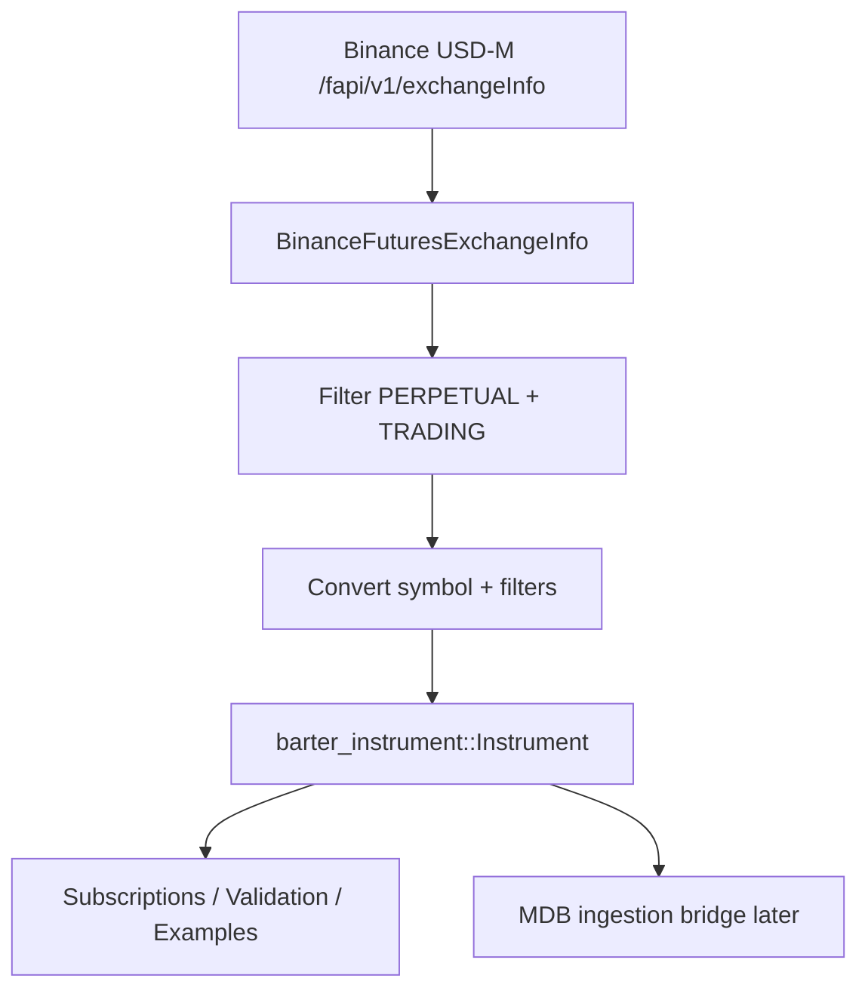

# Binance USD-M Futures Reference Discovery Design

Date: 2026-07-19

## Summary

Add first-class Binance USD-M Futures instrument reference discovery to `barter-data` by fetching and parsing `GET /fapi/v1/exchangeInfo`. The first increment exposes Binance raw exchange metadata and normalized Barter instruments with specs for trading status, symbol identity, base/quote assets, instrument kind, price tick, quantity step, and minimum notional. This closes the Layer 1 reference-data gap without introducing a global registry, cache, MDB writer, or capability descriptor runtime.

## Goals

- Add a Binance USD-M `exchangeInfo` REST fetcher.
- Parse Binance raw exchange info, symbols, and relevant filters with precision-safe `Decimal` fields.
- Normalize active USD-M perpetual symbols into existing `barter_instrument::Instrument` and `InstrumentSpec` types.
- Preserve enough raw Binance metadata for diagnostics and future mapping work.
- Add tests with representative fixtures for parsing, filtering, normalization, and HTTP error behavior.
- Add a no-credential example that discovers instruments and prints a small summary.

## Non-Goals

- Do not build a global instrument registry or catalog service in this increment.
- Do not add persistent caching, periodic refresh, diffing, or lifecycle events.
- Do not write to MDB or implement MDB canonical instrument IDs.
- Do not add the provider capability descriptor matrix in this increment.
- Do not support Binance COIN-M, Spot, Options, or other exchanges.
- Do not implement order placement validation. The discovered specs only provide source metadata for later consumers.
- Do not force reference discovery through the WebSocket-oriented `DynamicStreams` path.

## API Scope

Use the Binance USD-M Futures endpoint:

```text
GET https://fapi.binance.com/fapi/v1/exchangeInfo
```

Representative symbol fields to parse:

```json
{
  "symbol": "BTCUSDT",
  "pair": "BTCUSDT",
  "contractType": "PERPETUAL",
  "status": "TRADING",
  "baseAsset": "BTC",
  "quoteAsset": "USDT",
  "marginAsset": "USDT",
  "pricePrecision": 2,
  "quantityPrecision": 3,
  "onboardDate": 1569398400000,
  "deliveryDate": 4133404800000,
  "filters": [
    { "filterType": "PRICE_FILTER", "minPrice": "0.10", "tickSize": "0.10" },
    { "filterType": "LOT_SIZE", "minQty": "0.001", "stepSize": "0.001" },
    { "filterType": "MIN_NOTIONAL", "notional": "100" }
  ]
}
```

## Module and Public API

Add `barter-data/src/exchange/binance/futures/instrument.rs` and export it from `futures/mod.rs`.

Core pieces:

- `HTTP_EXCHANGE_INFO_URL_BINANCE_FUTURES_USD`.
- `BinanceFuturesExchangeInfoFetcher` or `BinanceFuturesUsdInstrumentFetcher`.
- `fetch_exchange_info() -> impl Future<Output = Result<BinanceFuturesExchangeInfo, SocketError>>`.
- Testable helper `fetch_exchange_info_url(url: String)` for local HTTP error tests.
- `BinanceFuturesExchangeInfo` raw response model.
- `BinanceFuturesSymbolInfo` raw symbol model.
- Filter enum or filter structs for at least:
  - `PRICE_FILTER`
  - `LOT_SIZE`
  - `MIN_NOTIONAL`
- Normalization method such as:

```rust
impl BinanceFuturesExchangeInfo {
    pub fn usd_m_perpetual_instruments(
        &self,
    ) -> Vec<Instrument<ExchangeId, AssetNameInternal>>;
}
```

The exact method name can follow the implementation style, but the API should make these semantics clear: return normalized Barter instruments for USD-M perpetual Binance symbols that are currently tradeable.

## Normalized Mapping

Map only symbols with:

- `contractType == "PERPETUAL"`
- `status == "TRADING"`
- Binance USD-M source endpoint

For each accepted symbol:

- `exchange`: `ExchangeId::BinanceFuturesUsd`
- `name_exchange`: raw Binance symbol, for example `BTCUSDT`
- `name_internal`: `InstrumentNameInternal::new_from_exchange(ExchangeId::BinanceFuturesUsd, symbol)`
- `underlying.base`: `baseAsset`
- `underlying.quote`: `quoteAsset`
- `quote`: `InstrumentQuoteAsset::UnderlyingQuote`
- `kind`: `InstrumentKind::Perpetual(PerpetualContract { contract_size: Decimal::ONE, settlement_asset: marginAsset })`
- `spec.price.min`: `PRICE_FILTER.minPrice`
- `spec.price.tick_size`: `PRICE_FILTER.tickSize`
- `spec.quantity.min`: `LOT_SIZE.minQty`
- `spec.quantity.increment`: `LOT_SIZE.stepSize`
- `spec.quantity.unit`: base asset quantity when the existing type can express it as `OrderQuantityUnits::Asset(base)`
- `spec.notional.min`: `MIN_NOTIONAL.notional`

All decimal string fields must deserialize directly to `Decimal` without intermediate `f64`.

If a required filter is missing from a symbol, skip that symbol in the normalized list or return a structured conversion error. The implementation plan should choose one policy explicitly before coding. For V1, prefer a `try_` conversion returning errors for single-symbol conversion, plus a best-effort list helper that drops invalid symbols only when it can report or test the reason.

## Raw Metadata Preservation

The raw model should keep provider-specific fields that are useful for future bridge work and diagnostics, including:

- symbol
- pair
- contract type
- status
- base asset
- quote asset
- margin asset
- price and quantity precision
- onboard date
- delivery date
- filters

This allows MDB or later capability descriptor code to inspect provider-specific context without re-fetching raw JSON.

## Data Flow



## Error Handling

- HTTP transport errors map to `SocketError::Http`, matching funding, index price, and open interest REST patterns.
- Non-2xx HTTP status must be surfaced with `error_for_status()` before JSON decoding.
- JSON decode failures map to `SocketError::Http`.
- Symbol-to-instrument conversion errors should identify the symbol and missing or invalid field/filter.
- Unsupported contract type or non-trading status is not a transport failure. It is normal provider metadata and should be filtered out by normalized perpetual discovery.

## Example

Add `barter-data/examples/binance_futures_reference_discovery.rs`.

The example should:

- Fetch Binance USD-M exchange info without credentials.
- Normalize tradeable perpetual instruments.
- Print the number of discovered instruments.
- Print a few sample instruments with exchange symbol, internal name, base/quote, tick size, step size, and min notional.

Automated verification only requires the example to compile. It should not require live Binance network success in CI-style checks.

## Testing Strategy

Follow TDD with focused tests before implementation.

Required test coverage:

1. Endpoint constant equals `https://fapi.binance.com/fapi/v1/exchangeInfo`.
2. Raw fixture deserializes representative exchange info and symbol fields.
3. Filter parsing preserves decimal precision for `tickSize`, `stepSize`, `minQty`, `minPrice`, and `notional`.
4. `TRADING + PERPETUAL` symbol normalizes into a Barter `Instrument` with expected exchange, names, base, quote, kind, and specs.
5. Non-perpetual or non-trading symbols are excluded from the normalized perpetual discovery helper.
6. Missing required filters produce a deterministic conversion error or deterministic exclusion, depending on the chosen implementation policy.
7. `fetch_exchange_info_url` surfaces HTTP status errors before JSON decoding using a local HTTP server with non-2xx invalid JSON.
8. Example compiles under `cargo check -p barter-data --examples`.

## Verification

Use disk-conscious verification commands:

```bash
rtk cargo fmt --all -- --check
CARGO_INCREMENTAL=0 CARGO_TARGET_DIR=/tmp/barter-rs-target-reference-discovery rtk cargo test -p barter-data exchange_info -- --nocapture
CARGO_INCREMENTAL=0 CARGO_TARGET_DIR=/tmp/barter-rs-target-reference-discovery rtk cargo check -p barter-data --examples
rtk git diff --check
```

Before claiming the implementation is complete, also run the broader package test suite if disk allows:

```bash
CARGO_INCREMENTAL=0 CARGO_PROFILE_DEV_DEBUG=0 CARGO_TARGET_DIR=/tmp/barter-rs-target-reference-discovery-full rtk cargo test -p barter-data -- --nocapture
CARGO_INCREMENTAL=0 CARGO_PROFILE_DEV_DEBUG=0 CARGO_TARGET_DIR=/tmp/barter-rs-target-reference-discovery-full rtk cargo check -p barter-data
```

## Future Extensions

- Add a reusable REST reference/source abstraction shared by reference discovery, funding rates, and open interest.
- Add provider capability descriptors that consume discovered instruments and support matrix information.
- Add refresh/diff support for symbols that list, delist, or change filters.
- Add MDB bridge mapping from normalized Barter instruments to canonical instrument IDs.
- Extend reference discovery to Binance Spot, COIN-M Futures, and other exchanges.
